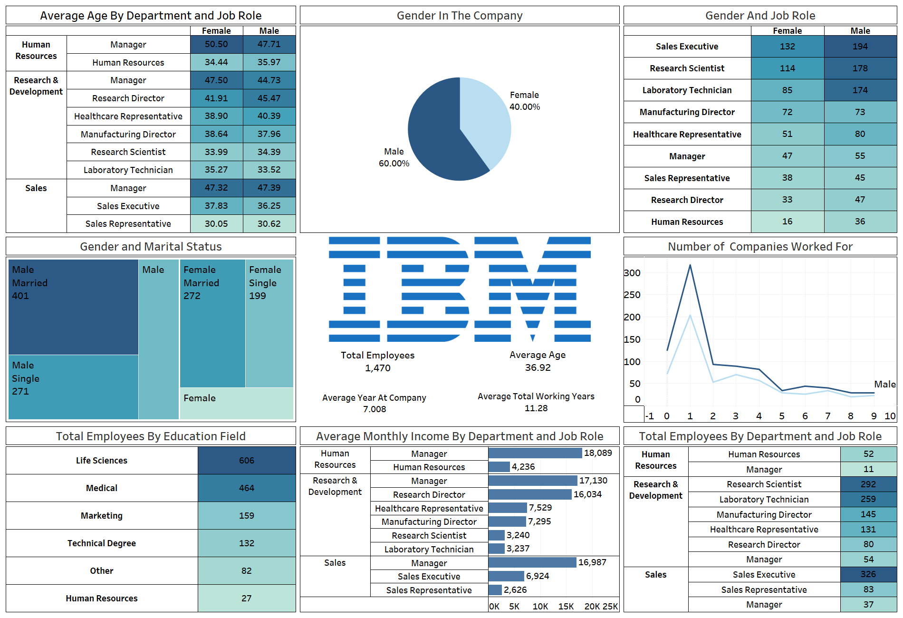

# 📊 IBM HR Analytics Dashboard (Tableau)

## 🔍 Project Overview

This project features an **interactive HR Analytics Dashboard** built using Tableau, based on IBM's publicly available HR dataset. The dashboard provides key insights into workforce demographics, job roles, income levels, education backgrounds, and employee tenure to support strategic human resource decisions.

## 🧰 Tools Used

- **Tableau Public** – for creating interactive data visualizations and dashboards.
- **Microsoft Excel / CSV** – for data cleaning and preparation.
- **Dataset**: `WA_Fn-UseC_-HR-Employee-Attrition.csv` (from IBM).

## 📁 Files in this Repository

| File | Description |
|------|-------------|
| `BIVA_Dashboard_IBM_HR.png` | Final Tableau dashboard screenshot |
| `WA_Fn-UseC_-HR-Employee-Attrition.csv` | Raw HR dataset from IBM |
| `BIVA_Project_B329_B264_HR.twb` | Tableau Workbook file (editable source for the dashboard) |

## 🧾 Key Insights Visualized

- 📌 **Gender Distribution** in the company  
- 📌 **Average Age** by department and job role  
- 📌 **Job Role & Gender** breakdown  
- 📌 **Marital Status** and Gender relationship  
- 📌 **Employee Count** by Education Field  
- 📌 **Monthly Income** by role and department  
- 📌 **Work History** (companies worked for)  
- 📌 **Department-wise headcounts**

## 📊 Dataset Description

The dataset consists of 1,470 employee records with 35 features such as:

- `Age`, `Gender`, `MaritalStatus`
- `Department`, `JobRole`, `EducationField`
- `MonthlyIncome`, `YearsAtCompany`, `TotalWorkingYears`
- `Attrition` and `NumCompaniesWorked`

This dataset is often used for workforce analysis, attrition modeling, and HR strategy formulation.

## 📈 Use Case Scenarios

- HR Planning and Recruitment Strategy
- Gender Equality and Pay Gap Analysis
- Departmental Performance Review
- Executive Presentations with Insightful Data

## ✅ Future Enhancements

- Add interactivity such as filters for department, age range, or job role.
- Include predictive metrics like attrition risk (if additional modeling is done).
- Publish to Tableau Public with live data filtering.

### 👤 Author

**Samiksha Suryawanshi**

Built using Tableau.  

